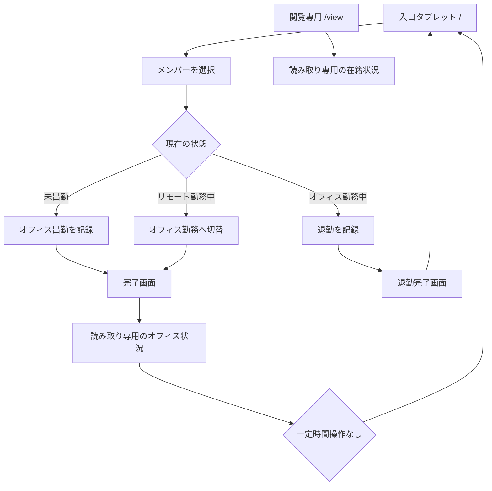

# 入口タブレット・閲覧専用 画面遷移アーキテクチャ

作成日: 2026-05-27

## 目的

オフィス入口に設置するタブレットで、メンバーが自分の名前を選び、出勤または退勤を記録できるようにする。出勤後は完了画面を短時間表示してから現在のバーチャルオフィス画面を表示する。退勤後は完了画面を短時間表示してから、次の人のために入口画面へ戻す。

一般メンバー向けには、別URLで閲覧専用の在籍状況ページを提供する。閲覧専用ページからは出勤、退勤、状態変更などの操作はできない。

## 画面の役割

### 入口タブレット画面

- URL: `/`
- オフィス入口のタブレットで常時表示する。
- メンバー一覧から自分の名前を選ぶ。
- 未出勤なら「オフィス出勤する」を表示する。
- オフィス勤務中なら「退勤する」を表示する。
- リモート勤務中なら「オフィス出勤に切り替える」を表示する。

### 完了画面

- 出勤または退勤操作の直後に表示する。
- 「谷口強志郎さん、オフィス出勤を記録しました」のように結果を明示する。
- 出勤時は数秒後にバーチャルオフィス画面へ遷移する。
- 退勤時は数秒後に入口タブレット画面へ戻る。

### 入口タブレット向けオフィス状況画面

- 出退勤操作後に表示する。
- 既存のバーチャルオフィス画面を読み取り専用で表示する。
- 一定時間操作がなければ入口タブレット画面に戻る。
- 「受付へ戻る」ボタンでも入口画面に戻れる。

### 閲覧専用ページ

- URL: `/view`
- 一般メンバーが自分のPCやスマホから在籍状況を見るためのページ。
- 出勤、退勤、リモート開始、状態変更はできない。
- オフィス勤務者、リモート勤務者、現在の在席人数を確認できる。

## 画面遷移

## 出退勤判定

| 現在の状態 | 入口タブレットの主ボタン | 実行内容 |
| --- | --- | --- |
| 未出勤 | オフィス出勤する | `workMode = office`, `entryMethod = office_qr` で勤務開始 |
| オフィス勤務中 | 退勤する | `action = checkout` で勤務終了 |
| リモート勤務中 | オフィス出勤に切り替える | 既存リモートセッションを閉じ、オフィス勤務を開始 |

現時点では既存スキーマとの互換を優先し、オフィス出勤の `entryMethod` は `office_qr` を使う。将来的に入口タブレット方式を明示したい場合は、`office_kiosk` や `office_tablet` の追加を検討する。

## 自動復帰

- 完了画面は約2〜3秒表示する。
- その後、読み取り専用のオフィス状況画面を表示する。
- オフィス状況画面で一定時間操作がなければ入口画面に戻る。
- 画面に触れた場合はタイマーを延長する。

## 閲覧専用の制約

- `/view` では操作ボタンを表示しない。
- メンバー切替、出勤、退勤、状態変更、リモート開始は不可。
- 表示更新は通常のポーリングで行う。

## 受け入れ基準

- `/` を開くと入口タブレット画面が表示される。
- 未出勤メンバーを選んで押すとオフィス出勤になる。
- オフィス勤務中メンバーを選んで押すと退勤になる。
- リモート勤務中メンバーを選んで押すとオフィス勤務へ切り替わる。
- 操作後に完了画面が表示される。
- 出勤または切替の完了画面後に読み取り専用のバーチャルオフィス画面が表示される。
- 退勤の完了画面後に入口タブレット画面へ戻る。
- 一定時間後に入口画面へ戻る。
- `/view` では在籍状況を見られるが、出退勤操作はできない。
