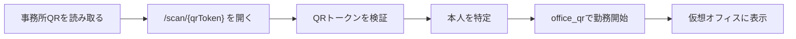

# QRコード・手動勤怠 仕様案

作成日: 2026-05-27

## 結論

勤怠開始方式は、いったん以下の2つに絞る。

- オフィス出社: 事務所のQRコードを読み取って勤務開始する。
- リモートワーク: Web画面のリモート開始ボタンを押して勤務開始する。

オフィス出社は `entryMethod = office_qr`、リモートは `entryMethod = remote_manual` として履歴に残す。入口タブレットでは、同じ画面でオフィス出勤と退勤の両方を扱う。

## 今回やること

- QRコード方式と手動方式を正とする仕様を確定する。
- 位置情報や端末側の自動化を前提にした資料・文言は削除する。
- 現在のサンプル履歴はQR/リモートのテスト履歴として整える。
- 次の実装で、QR読み取りから勤務開始までの流れを明確にする。

## 対象外

- 位置情報による勤務開始。
- 端末常駐型の自動開始。
- オフィスネットワーク接続による勤務開始。
- 勤怠専用アプリの配布。

## 勤務開始フロー

### オフィス出社

理想の動き:

1. 事務所に掲示されたQRコードをスマホで読み取る。
2. `/scan/{qrToken}` が開く。
3. QRトークンが有効なら、本人のオフィス勤務を開始する。
4. 仮想オフィス上にその人がオフィス出勤として表示される。
5. 履歴に `office_qr` として勤務開始が残る。



重要なのは、勤務開始には「操作した本人」が分かる必要があること。現時点では入口タブレットで本人が自分の名前を選ぶ方式とし、将来、個人端末のQR読み取りや認証を入れる場合はログイン済みユーザーと紐づける。

### リモートワーク

1. Web画面で本人を選択する、または将来の認証済み本人を使う。
2. 「リモートで入る」を押す。
3. `remote_manual` として勤務開始する。
4. 仮想オフィス上にリモート勤務として表示する。

### 退勤

1. Web画面で「退室する」を押す。
2. 現在の勤務セッションを終了する。
3. `checkedOutAt` と `checkoutReason = manual_checkout` を残す。
4. 仮想オフィス上から表示を外す。

## 実装段階

### Phase 1: 入口タブレットでの出退勤受付

オフィス入口にタブレットを置く前提で、名前選択による出勤・退勤を扱う。

- URL: `/`
- 未出勤メンバーは「オフィス出勤する」を押す。
- オフィス勤務中メンバーは「退勤する」を押す。
- リモート勤務中メンバーは「オフィス出勤に切り替える」を押す。
- 出勤成功時は `workMode = office`, `entryMethod = office_qr` で保存する。
- 操作後は完了画面を表示し、読み取り専用のオフィス状況画面へ遷移する。

この段階は、入口受付として現場運用を早く試すための方式。

### Phase 2: 閲覧専用ページの分離

一般メンバーが自分の端末から在籍状況だけを見られるページを分ける。

- URL: `/view`
- 出勤、退勤、リモート開始、状態変更は不可。
- 現在のオフィス勤務者とリモート勤務者を確認できる。

この段階が、入口タブレットと一般閲覧を混ぜないための完成形。

## API仕様

### `POST /api/presence`

既存APIを使う。

#### オフィス勤務開始

Request:

```json
{
  "userId": "taniguchi-kyoshiro",
  "workMode": "office",
  "status": "active",
  "entryMethod": "office_qr",
  "qrToken": "86-lab-office-main"
}
```

Server behavior:

- `userId` が存在するか確認する。
- `workMode = office` の場合は `qrToken` を必須にする。
- `qrToken` が `office.qrToken` と一致するか確認する。
- すでに同じ人がオフィス出勤中なら、重複セッションを作らず `lastSeenAt` だけ更新する。
- リモート勤務中からオフィス勤務へ切り替える場合、既存セッションを `mode_switch` で終了し、新しいオフィス勤務セッションを作る。

Success:

```json
{
  "ok": true,
  "state": {}
}
```

Invalid QR:

```json
{
  "ok": false,
  "error": "invalid_qr_token",
  "message": "このQRは86研究所の入室QRとして認証できません。"
}
```

#### リモート勤務開始

Request:

```json
{
  "userId": "taniguchi-kyoshiro",
  "workMode": "remote",
  "status": "active",
  "entryMethod": "remote_manual"
}
```

Server behavior:

- `userId` が存在するか確認する。
- リモート開始ではQRトークンを要求しない。
- すでに同じ人がリモート勤務中なら、重複セッションを作らず `lastSeenAt` だけ更新する。

#### 退勤

Request:

```json
{
  "userId": "taniguchi-kyoshiro",
  "action": "checkout"
}
```

Server behavior:

- 現在の在席を削除する。
- 未終了の勤務セッションに `checkedOutAt` を入れる。
- `checkoutReason = manual_checkout` を残す。
- イベント履歴に退室を残す。

## データ仕様

### `office`

| field | description |
| --- | --- |
| `id` | オフィスID |
| `name` | 表示名。例: `86研究所` |
| `location` | 表示用所在地 |
| `qrToken` | QRコードに含めるオフィストークン |

### `currentPresence`

現在出勤中の人だけを入れる。初期状態では空配列でよい。

| field | description |
| --- | --- |
| `userId` | メンバーID |
| `workMode` | `office` または `remote` |
| `status` | `active`, `away`, `meeting` |
| `entryMethod` | `office_qr` または `remote_manual` |
| `since` | 勤務開始時刻 |
| `lastSeenAt` | 最終更新時刻 |
| `seatLabel` | 表示座席 |

### `attendance_sessions`

勤務履歴。勤務開始ごとに1行作る。

| field | description |
| --- | --- |
| `workMode` | `office` または `remote` |
| `entryMethod` | `office_qr`, `remote_manual`, `admin_edit`, `auto_timeout` |
| `checkedInAt` | 勤務開始時刻 |
| `checkedOutAt` | 退勤時刻。勤務中は `null` |
| `status` | 現在または終了時の状態 |
| `memo` | 表示用メモ |
| `checkoutReason` | `manual_checkout`, `mode_switch` など |

### `presence_events`

画面下部や管理画面に出すイベントログ。

| event_type | description |
| --- | --- |
| `check_in` | オフィス勤務開始 |
| `remote_in` | リモート勤務開始 |
| `checkout` | 退室 |
| `away` | 離席 |
| `meeting` | 会議中 |
| `active` | 作業中 |

## UI仕様

### ヘッダー

- 「入退室QR」ボタンを表示する。
- 押すと事務所QRのモーダルを開く。
- 「リモートで入る」ボタンを表示する。

### QRモーダル

- 事務所QRを表示する。
- QR URLは `/scan/{office.qrToken}` とする。
- QRトークンの状態を表示する。
- 入口タブレットでは、選択中メンバーの状態に応じて「オフィス出勤する」「退勤する」「オフィス出勤に切り替える」を表示する。
- 閲覧専用ページでは、QRモーダルや出退勤ボタンを表示しない。

### スキャン画面

- `/scan/{qrToken}` で同じアプリを開く。
- 有効なQRならオフィス勤務開始フローに進む。
- 無効なQRなら開始せず、エラーメッセージを表示する。

### 仮想オフィス表示

- オフィス勤務中の人はオフィス側に表示する。
- リモート勤務中の人はリモート側に表示する。
- 未出勤の人は仮想オフィス上に表示しない。

## セキュリティ方針

### MVP

- 事務所QRの `qrToken` を一致確認する。
- 事務所QRを知っている人だけがオフィス勤務開始できる前提にする。
- 無効なQRでは勤務開始できない。

### 本番寄りにする場合

- 将来は認証済みユーザーとQR読み取りを組み合わせる。
- QRトークンを管理画面から再発行できるようにする。
- QRトークンが流出した場合は古いQRを無効化する。
- 管理者による修正履歴を残す。
- 将来的には、日替わりまたは時間制限付きQRも検討する。

## エラー仕様

| error | condition | message |
| --- | --- | --- |
| `qr_token_required` | オフィス勤務開始なのにQRトークンがない | QR入室には有効なオフィスQRが必要です。 |
| `invalid_qr_token` | QRトークンが一致しない | このQRは86研究所の入室QRとして認証できません。 |
| `member_not_found` | 指定メンバーが存在しない | メンバーが見つかりません。 |
| `presence_not_found` | 状態変更対象の在席がない | 在席情報が見つかりません。 |
| `persistent_database_required` | 本番環境でDB未設定 | Supabase環境変数が必要です。 |

## 受け入れ基準

- `/scan/{qrToken}` でQR入室画面が開く。
- 正しいQRトークンならオフィス勤務を開始できる。
- 間違ったQRトークンなら勤務開始できない。
- オフィス勤務の履歴に `office_qr` が残る。
- リモート勤務の履歴に `remote_manual` が残る。
- 同じ人が同じ勤務モードで連続操作しても、未終了セッションが重複しない。
- リモートからオフィス、またはオフィスからリモートへ切り替えると、前のセッションが閉じる。
- 初期状態では全員未出勤でも画面が破綻しない。

## 実装準備チェックリスト

- [ ] QR/手動方式を今回の正式方針として確認する。
- [ ] 入口タブレットの自動復帰時間を決める。
- [ ] 事務所QRのURLを本番ドメインで確定する。
- [ ] QRコードを印刷または現地掲示できる形にする。
- [ ] 画面上の文言を「勤務開始」「退勤」に寄せるか、「入室」「退室」のままにするか決める。
- [ ] 管理者修正が必要な範囲を決める。
- [ ] Supabase移行後も `office_qr` と `remote_manual` を維持する。

## 推奨する次の一手

まずはPhase 1として、入口タブレットの出退勤受付を磨くのがよい。具体的には、名前選択、状態に応じた主ボタン、完了画面、自動復帰、閲覧専用ページを整える。その後、必要に応じて個人端末QRや認証ログインに進める。

## 関連仕様

- `docs/LOGIN_AND_QR_FLOW_ARCHITECTURE.md`
  - 入口タブレット、完了画面、閲覧専用ページ、既存オフィス画面の関係を定義する。
